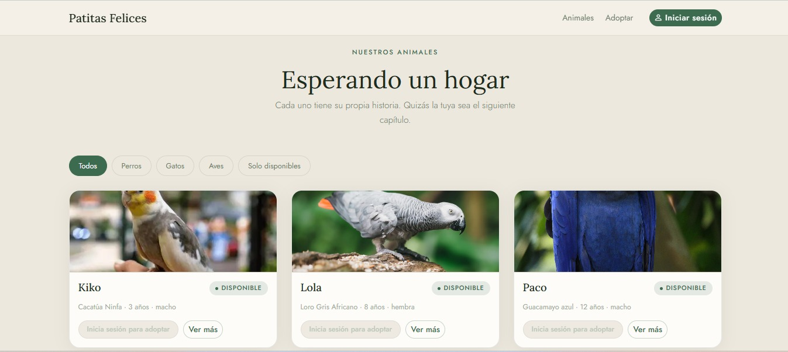
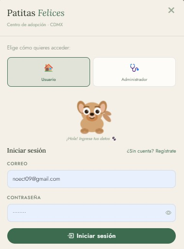
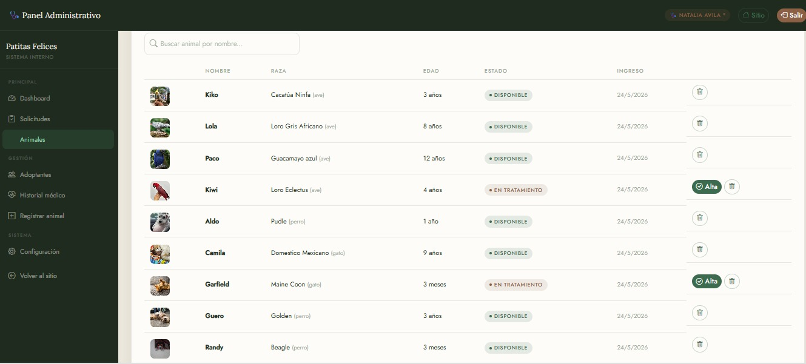
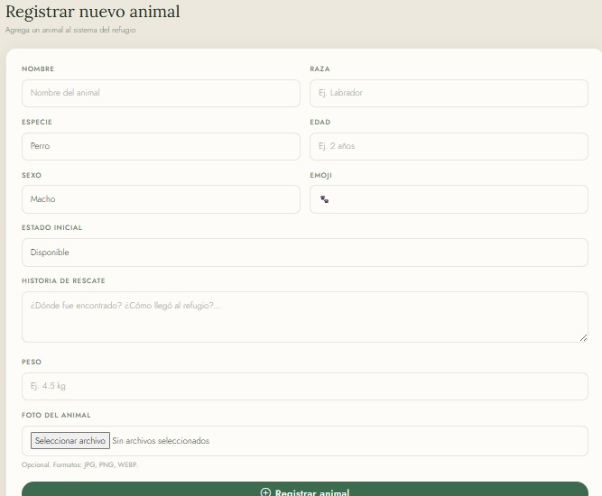

# DB-Coursework-2026-2

Repositorio de entrega para la asignatura de Bases de Datos (semestre 2026-2).

## Instrucciones de entrega — Fork y Pull Request

Cada estudiante debe integrar su proyecto a este repositorio mediante un Pull Request (PR) desde su fork. Sigue este procedimiento y el formato de ejemplo: https://github.com/gabrielhuav/DB-Coursework-2026-1

Pasos rápidos para enviar tu PR:

1. Haz fork de este repositorio a tu cuenta de GitHub.
2. Clona tu fork localmente:

```bash
git clone https://github.com/<tu-usuario>/DB-Coursework-2026-2.git
cd DB-Coursework-2026-2
```

3. Modifica el `README.md` y


4. Haz commit y push a tu fork (usa `main` o una rama propia):

```bash
git add <tu-usuario>
git commit -m "Add project for <tu-usuario>"
git push origin main
```

6. Abre un Pull Request desde tu fork hacia `gabrielhuav/DB-Coursework-2026-2` (base: `main`).

## Proyecto 1: Booksnexus (Red social de libros)
Plataforma web tipo red social enfocada en lectores, donde los usuarios pueden registrarse, compartir reseñas, publicar opiniones sobre libros, seguir a otros usuarios y descubrir nuevas lecturas mediante interacción social.

### 🛠️ Tecnologías
* *Backend:* Node.js con Express.js
* *Base de Datos:* PostgreSQL (Supabase)
* *Frontend:* HTML, CSS y JavaScript vanilla (Fetch API)
* *Despliegue:* Render y GitHub pages

<details>
<summary>🖼️ Ver capturas de pantalla</summary>

| | |
|---|---|
|  | |
|  |  |
|  | |
</details>

### ✨ Funcionalidades principales
* Registro e inicio de sesión de usuarios
* Publicación de reseñas y opiniones de libros
* Sistema de seguidores y seguidos
* Timeline con publicaciones de usuarios seguidos
* Gestión de libros favoritos
* Persistencia de datos mediante PostgreSQL
* API REST para comunicación entre frontend y backend

### 🔗 Enlaces
Código Fuente Backend: [Repositorio Backend](https://github.com/Diegocstln/booksnexus-back)
Código Fuente Frontend: [Repositorio Frontend](https://github.com/Diegocstln/mi-proyecto-bd)
Demo en Vivo: [Booksnexus Web](https://diegocstln.github.io/mi-proyecto-bd/)
---

## Proyecto 2: Patitas Felices (Refugio de Animales)

Plataforma web para la gestión integral de un refugio de animales, donde los usuarios pueden registrarse, buscar mascotas disponibles, enviar solicitudes de adopción y dar seguimiento a su proceso. El personal del refugio cuenta con un panel administrativo para gestionar animales, solicitudes e historial médico.

### 🛠️ Tecnologías

- **Backend:** Node.js con Express.js
- **Base de Datos:** PostgreSQL (Supabase)
- **Frontend:** HTML, CSS (Bootstrap 5) y JavaScript vanilla (Fetch API)
- **Despliegue:** Render y GitHub Pages

### ✨ Funcionalidades principales

* Registro e inicio de sesión de adoptantes y trabajadores (con roles: admin, veterinario, voluntario)
* Catálogo de animales con filtros por especie y estado
* Sistema de solicitudes de adopción (envío, aprobación y rechazo)
* Historial médico por animal
* Panel de estadísticas en tiempo real (animales disponibles, adoptados, solicitudes pendientes)
* Subida de fotos de animales en Base64
* Validaciones de formularios con expresiones regulares
* API REST completa con manejo de errores
<details>
<summary>🖼️ Ver capturas de pantalla</summary>

| | |
|---|---|
|  |  |
|  |   |

</details>


### 🔗 Enlaces

- **Código Fuente:** [Repositorio en GitHub](https://github.com/JOKERKORIO/patitas-api)
- **Demo en Vivo (Railway):** [Patitas Felices API](https://patitas-backend-production.up.railway.app/)
- **Demo en Vivo (GitHub Pages):** [Patitas Felices Web](https://jokerkorio.github.io/patitas-api/#)
