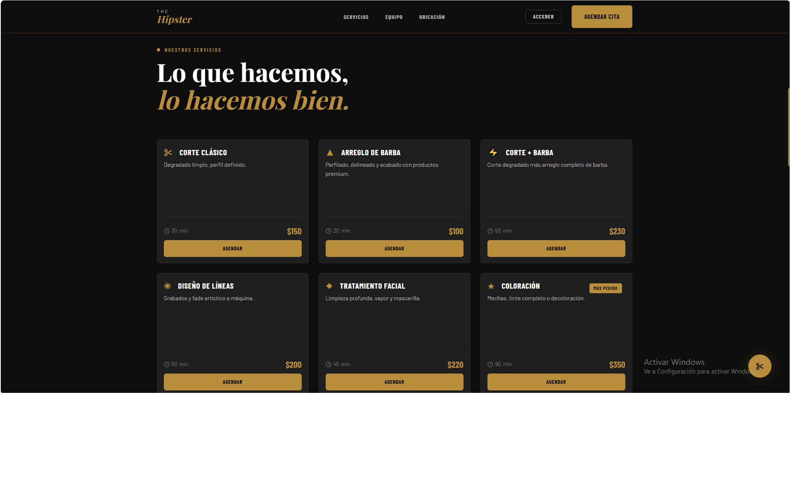
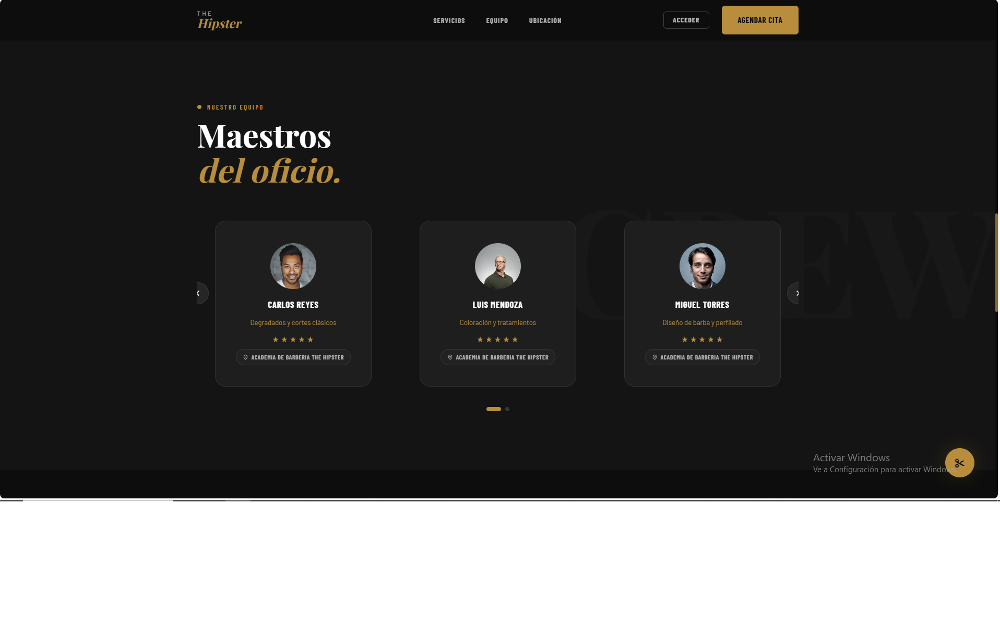
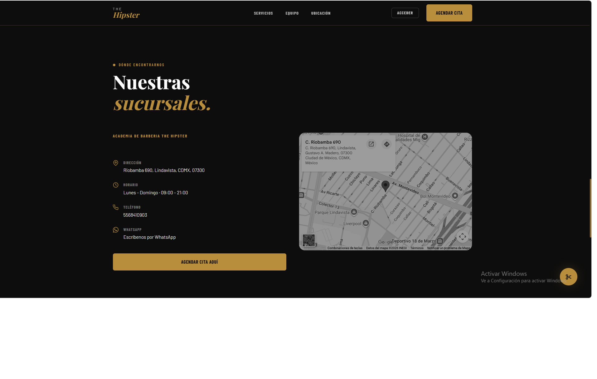
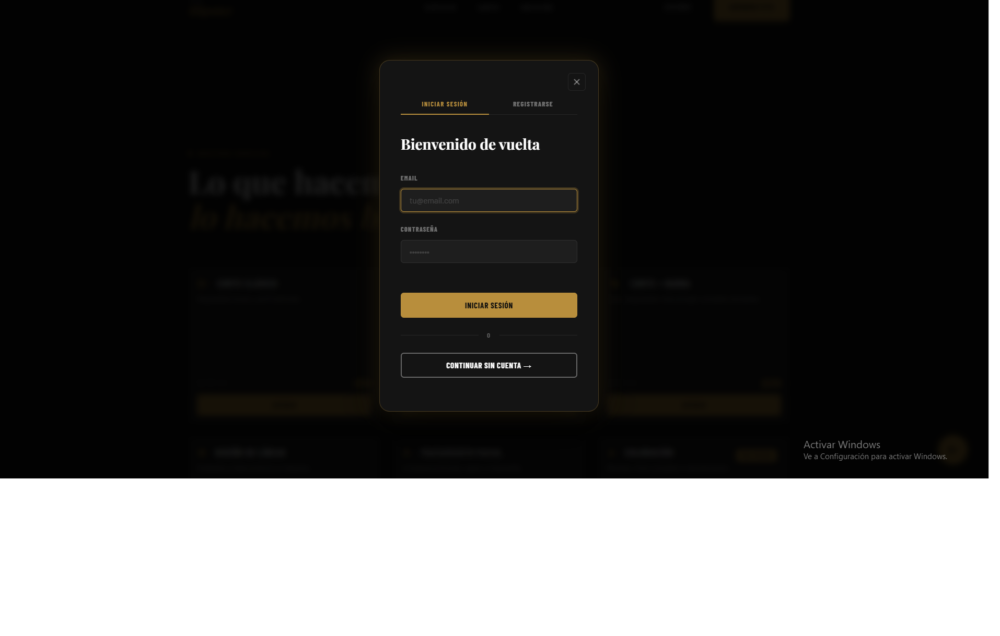
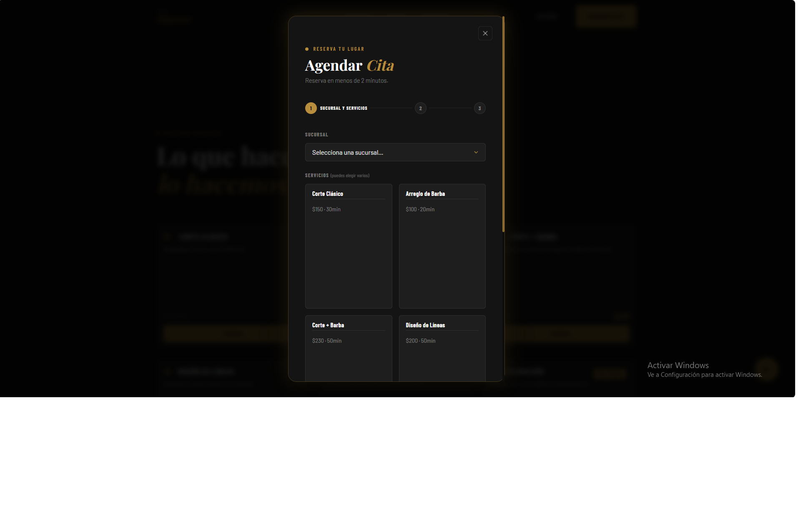

# DB-Coursework-2026-2

Repositorio de entrega para la asignatura de Bases de Datos (semestre 2026-2).

## Instrucciones de entrega — Fork y Pull Request

Cada estudiante debe integrar su proyecto a este repositorio mediante un Pull Request (PR) desde su fork. Sigue este procedimiento y el formato de ejemplo: https://github.com/gabrielhuav/DB-Coursework-2026-1

Pasos rápidos para enviar tu PR:

1. Haz fork de este repositorio a tu cuenta de GitHub.
2. Clona tu fork localmente:

```bash
git clone https://github.com/<tu-usuario>/DB-Coursework-2026-2.git
cd DB-Coursework-2026-2
```

3. Modifica el `README.md` y


4. Haz commit y push a tu fork (usa `main` o una rama propia):

```bash
git add <tu-usuario>
git commit -m "Add project for <tu-usuario>"
git push origin main
```

6. Abre un Pull Request desde tu fork hacia `gabrielhuav/DB-Coursework-2026-2` (base: `main`).

## Proyecto 1: Booksnexus (Red social de libros)
Plataforma web tipo red social enfocada en lectores, donde los usuarios pueden registrarse, compartir reseñas, publicar opiniones sobre libros, seguir a otros usuarios y descubrir nuevas lecturas mediante interacción social.

### 🛠️ Tecnologías
* *Backend:* Node.js con Express.js
* *Base de Datos:* PostgreSQL (Supabase)
* *Frontend:* HTML, CSS y JavaScript vanilla (Fetch API)
* *Despliegue:* Render y GitHub pages

<details>
<summary>🖼️ Ver capturas de pantalla</summary>

| | |
|---|---|
|  | |
|  |  |
|  | |
</details>

### ✨ Funcionalidades principales
* Registro e inicio de sesión de usuarios
* Publicación de reseñas y opiniones de libros
* Sistema de seguidores y seguidos
* Timeline con publicaciones de usuarios seguidos
* Gestión de libros favoritos
* Persistencia de datos mediante PostgreSQL
* API REST para comunicación entre frontend y backend

### 🔗 Enlaces
Código Fuente Backend: [Repositorio Backend](https://github.com/Diegocstln/booksnexus-back)
Código Fuente Frontend: [Repositorio Frontend](https://github.com/Diegocstln/mi-proyecto-bd)
Demo en Vivo: [Booksnexus Web](https://diegocstln.github.io/mi-proyecto-bd/)

## Proyecto 2: Barber Cerdas (Sistema de gestión de citas)
Sistema web de reservas para la Academia De Barbería The Hipster (Lindavista, CDMX). Los clientes agendan citas en línea, los barberos gestionan su jornada desde un dashboard en tiempo real y el administrador orquesta walk-ins y reservas telefónicas, unificando los tres canales (online, telefónica y walk-in) en una sola entidad de cita.

### 🛠️ Tecnologías
* *Frontend:* HTML5, CSS3 y JavaScript Vanilla (sin frameworks ni bundlers)
* *Backend / Base de Datos:* Supabase (PostgreSQL + Auth + REST API) con RLS, RPCs, triggers y vistas
* *Realtime:* Supabase Realtime (WebSocket) con fallback por polling
* *Serverless / Email:* Vercel Functions (Node.js) + Resend
* *Despliegue:* Vercel (CI continuo desde GitHub)

<details>
<summary>🖼️ Ver capturas de pantalla</summary>

| | |
|---|---|
|  |  |
|  |  |
|  |  |
</details>

### ✨ Funcionalidades principales
* Reserva de citas en línea mediante wizard (sucursal → servicios → barbero/horario → datos)
* Confirmación de citas por email con token de un solo uso que expira en 10 minutos
* Dashboard de administración con semáforo de barberos en tiempo real
* Registro de walk-ins desde un kiosko en mostrador y gestión de reservas telefónicas
* Identidad portable: un cliente anónimo que se registra conserva su historial
* Anti-spam: una reserva por teléfono al día por sucursal, sin lockout
* Arquitectura lista para múltiples sucursales
* Cuenta de cliente con historial y cancelación de citas (/mi-cuenta)
* Seguridad mediante Row Level Security activa en todas las tablas

### 🔗 Enlaces
Código Fuente: [Repositorio del proyecto](https://github.com/StrlgE26/Barberia)
Demo en Vivo: [Barber Cerdas](https://www.koddesolutions.com/)
