# 📚 DB-Coursework-2026-2 — Repositorio de Proyectos

Repositorio oficial de entrega para la asignatura de **Bases de Datos** (semestre 2026-2). A continuación se presentan los proyectos desarrollados por los estudiantes, ordenados por complejidad técnica, calidad de documentación, funcionalidades implementadas y profesionalismo en el despliegue.

> **Nota:** Las capturas de pantalla se generan automáticamente desde los demos en vivo usando servicios de screenshot. Si alguna imagen no carga, el demo sigue disponible en el enlace correspondiente.

---

## 🏆 Top Proyectos Destacados

### 🥇 Proyecto 1: VinylVibes — Tienda de Vinilos con APIs Externas
> 🎵 E-commerce de vinilos con integración a Discogs, Last.fm y YouTube, caché Redis, JWT, rate limiting y diseño editorial premium.

<details>
<summary>🖼️ Ver capturas de pantalla</summary>

| |
|---|
| 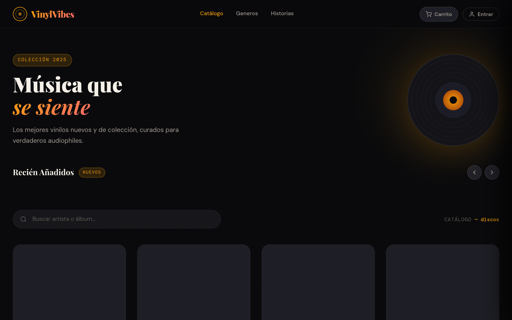 |
|  |
|  |
|  |
|  |

</details>

<details>
<summary>📊 Ver diagramas</summary>

| Modelo Relacional | Modelo Entidad-Relación Extendido |
|---|---|
|  |  |

</details>

#### 🛠️ Stack Tecnológico

| Capa | Tecnología |
|---|---|
| **Backend** | Node.js + Express, Prisma (ORM), JWT + bcrypt, express-rate-limit, ioredis |
| **Base de Datos** | PostgreSQL (Neon) |
| **Caché** | Redis (Render) |
| **Frontend** | HTML5, CSS3, JavaScript vanilla, Google Fonts (Playfair Display, DM Sans, DM Mono) |
| **APIs Externas** | Discogs, Last.fm, YouTube Data API v3 |
| **Despliegue** | Render (Backend) + GitHub Pages (Frontend) |

#### ✨ Funcionalidades Principales
- 🔍 Búsqueda con debounce (500ms) consumiendo API de Discogs
- 🎧 Catálogo con paginación y filtros por género (10 géneros)
- 📜 Modal de detalle con historia (Last.fm), video (YouTube) y recomendaciones
- 🛒 Carrito sincronizado entre pestañas vía evento `storage`
- 💳 Checkout con cálculo dinámico de precios según año y popularidad
- 👥 Sistema de roles: `cliente`, `vendedor`, `admin`, `demo`
- 🔐 Autenticación JWT con expiración de 7 días
- 📊 Panel admin con estadísticas, gestión de usuarios y ventas
- ⚡ Caché Redis con TTL diferenciado por tipo de dato
- 🛡️ Rate limiting global (100 req/min) y específico en auth (10/15 min)

#### 🔑 Credenciales de Demo
| Campo | Valor |
|---|---|
| Usuario | `admin_chocolate` |
| Contraseña | `chocolate` |

#### 🔗 Enlaces
| Recurso | Enlace |
|---|---|
| 📦 Código Backend | [akibanks/api-tienda-vinilos](https://github.com/akibanks/api-tienda-vinilos) |
| 🎨 Código Frontend | [akibanks/tienda_musica_web](https://github.com/akibanks/tienda_musica_web) |
| 🌐 Demo en Vivo | [VinylVibes](https://akibanks.github.io/tienda_musica_web/) |
| 💾 Versión Estática | [Frontend Local](https://20gercha06-stack.github.io/VinylVibes_Local_Front/) |

---

### 🥈 Proyecto 2: Obras Públicas — Dirección de Obras de Temascaltepec
> 🏛️ Sistema integral de gestión de infraestructura pública con 4 roles jerárquicos, diseño Dark Mode con Glassmorphism y animaciones Canvas.

<details>
<summary>🖼️ Ver capturas de pantalla</summary>

| |
|---|
|  |
|  |
|  |
| 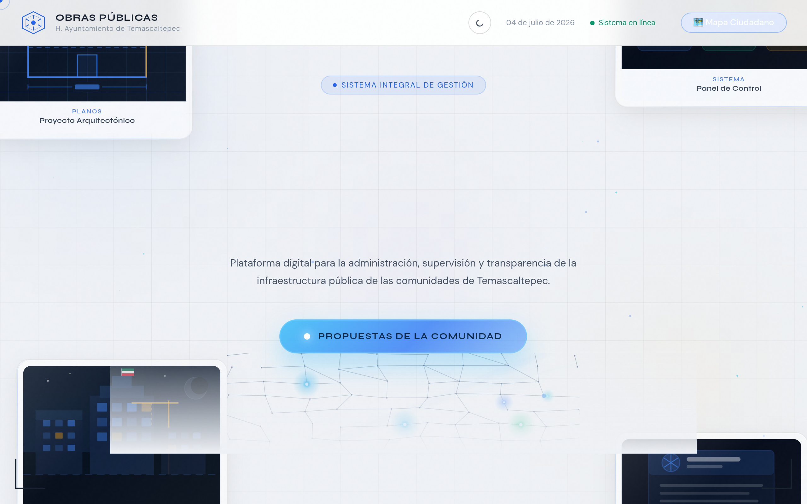 |
|  |
|  |

</details>

<details>
<summary>📊 Ver diagramas</summary>

| Diagrama Relacional | Diagrama Entidad-Relación Extendido |
|---|---|
|  |  |

</details>

#### 🛠️ Stack Tecnológico

| Capa | Tecnología |
|---|---|
| **Lenguaje** | Python 3.11 |
| **Framework** | Flask 3.0 |
| **ORM** | Flask-SQLAlchemy 3.1 / SQLAlchemy 2.0 |
| **Base de Datos** | PostgreSQL (Supabase) |
| **Frontend** | HTML5, CSS3 (Custom Properties, Flexbox, Grid), JavaScript ES6+ |
| **Diseño** | Dark Mode + Glassmorphism + Canvas API (animación de circuitos) |
| **Seguridad** | PBKDF2-SHA256 con salt de 16 bytes, decorador `@require_auth` |
| **Despliegue** | Docker / Podman |

#### ✨ Funcionalidades Principales
- 👔 **Director**: Wizard multi-paso, catálogo de constructoras, fuentes de financiamiento (FISM, FORTAMUN)
- 📐 **Proyectista**: Desglose de costos (Materiales, Mano de Obra, Equipo), gráficos dinámicos
- 📋 **Supervisor**: Bitácora de avance, sliders sincronizados (avance físico vs financiero)
- 🗂️ **Secretaría**: Gestión de oficios, actas, validación legal, concursos de selección
- 🗺️ **Mapa ciudadano público** con consulta abierta
- 🔐 Autenticación por headers `X-User-Role` y `X-User-Id`

#### 🔑 Credenciales de Demo

| Rol | Usuario | Contraseña |
|---|---|---|
| Director | `demo_director` | `DemoDir2026!` |
| Supervisor | `demo_supervisor` | `DemoSup2026!` |
| Secretaria | `demo_secretaria` | `DemoSec2026!` |
| Proyectista | `demo_proyectista` | `DemoPry2026!` |

#### 🔗 Enlaces
| Recurso | Enlace |
|---|---|
| 📦 Código Fuente | [Urigc/Obras_publicas](https://github.com/Urigc/Obras_publicas/tree/TestDefinitivo) |
| 🌐 Demo en Vivo | [GitHub Pages](https://urigc.github.io/Obras_publicas/) |
| 🧪 Entorno de Pruebas | [Demo Interactivo](https://urigc.github.io/Obras_Pub/) |

---

### 🥉 Proyecto 3: Notaría 105 — Sistema Integral Notarial
> ⚖️ Plataforma segura con firma autógrafa digital (Canvas), auditoría notarial, portal ciudadano y arquitectura multi-capa.

<details>
<summary>🖼️ Ver capturas de pantalla</summary>

| |
|---|
|  |
| 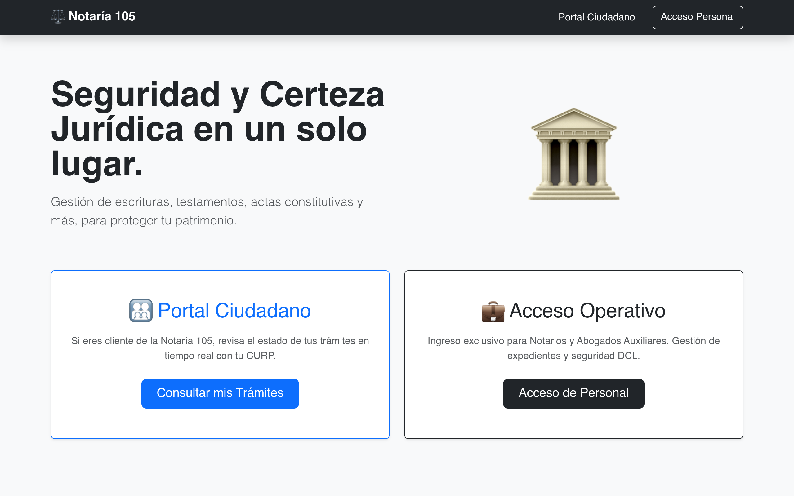 |
|  |
|  |

</details>

#### 🛠️ Stack Tecnológico

| Capa | Tecnología |
|---|---|
| **Backend** | Python 3 + Flask |
| **Base de Datos** | PostgreSQL con `psycopg2` (transacciones ACID, DCL) |
| **Seguridad** | `Werkzeug.security` (SHA-256), `python-dotenv`, consultas parametrizadas |
| **Frontend** | HTML5, CSS3, JavaScript Vanilla + Canvas API, Bootstrap 5 |
| **Despliegue** | Render |

#### ✨ Funcionalidades Principales
- 🖋️ **Firma autógrafa digital** en Canvas con codificación Base64
- 📋 CRUD relacional complejo de expedientes (Testamentos, Actas, Compraventas)
- 🗂️ Borrado lógico con panel de archivo histórico (auditoría)
- 👁️ Portal ciudadano con validación CURP + correo
- 📄 Generación de documento oficial con Jinja2 + CSS
- 🔐 Segmentación DCL con rol `cliente_web`

#### 🔑 Credenciales
| Rol | Usuario | Contraseña |
|---|---|---|
| Notario | `notario@notaria105.com` | `notario123` |
| Abogado | `abogado@notaria105.com` | `abogado123` |
| Cliente | `cliente@example.com` | CURP: `PELJ850303HDFRPN03` |

#### 🔗 Enlaces
| Recurso | Enlace |
|---|---|
| 📦 Código Fuente | [s06008525-max/notaria-105](https://github.com/s06008525-max/notaria-105) |
| 🌐 Demo en Vivo | [notaria-105.onrender.com](https://notaria-105.onrender.com/) |
| 💾 Versión Estática | [ingmatmus7-ai/notaria105_estatica](https://ingmatmus7-ai.github.io/notaria105_estatica/) |

---

## 📋 Listado Completo de Proyectos

### 📖 Proyecto 4: ABV Library — Gestión de Librería
> 📚 Sistema marketplace con 3 roles, API Open Library, sistema de puntos, préstamos con multas y 3 temas visuales.

<details>
<summary>🖼️ Ver capturas de pantalla</summary>

| |
|---|
|  |
|   |
|   |
|   |
|   |
|  |

</details>

#### 🛠️ Stack Tecnológico
| Capa | Tecnología |
|---|---|
| **Backend** | Node.js + Express 5 |
| **Base de Datos** | PostgreSQL (Render) — 14 tablas |
| **Frontend** | HTML, CSS, JavaScript vanilla (Fetch API) |
| **Autenticación** | bcrypt (10 salt rounds) |
| **API Externa** | Open Library Search API |

#### ✨ Funcionalidades
- 📖 Catálogo con búsqueda en tiempo real (Local/Global)
- 🛒 Carrito multi-libro con control de stock
- 📅 Préstamos con multas automáticas ($10/día)
- 🎁 Sistema de puntos (1 punto por cada $10)
- 💝 Donaciones con recompensas
- 🎨 3 temas: Claro, Oscuro, Night shift
- 👥 Roles: Administrador, Bibliotecario, Cliente

#### 🔑 Credenciales
| Campo | Valor |
|---|---|
| Correo | `visitante@abvlibrary.com` |
| Contraseña | `visitante1234` |

#### 🔗 Enlaces
| Recurso | Enlace |
|---|---|
| 📦 Código Fuente | [AbelGod27/Libreria_va](https://github.com/AbelGod27/Libreria_va) |
| 🌐 Demo GitHub Pages | [ABV Library](https://abelgod27.github.io/abv_library/) |
| 🚀 Demo Render | [libreria-va.onrender.com](https://libreria-va.onrender.com) |

---

### 🎉 Proyecto 5: MANTRA — Red Social de Eventos
> 🎊 Plataforma social para descubrir eventos, con Cloudinary, chat, logros, métricas y feed interactivo.

<details>
<summary>🖼️ Ver capturas de pantalla</summary>

| Landing Page | Feed de Eventos |
|---|---|
| 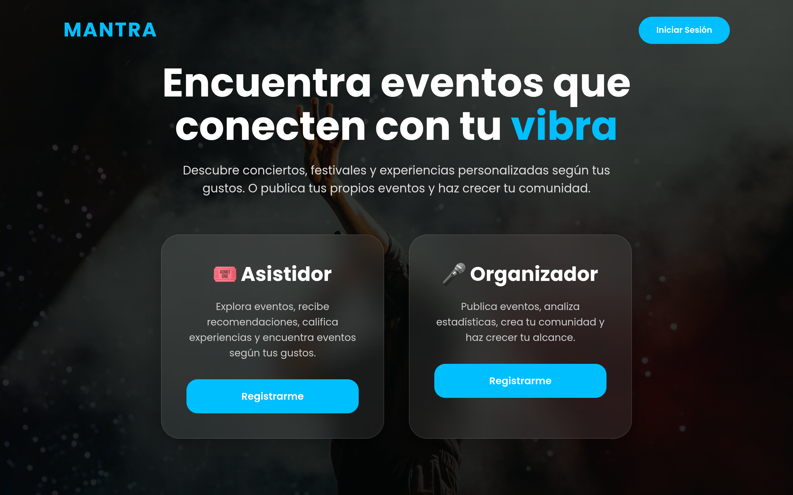 |  |
| **Dashboard Organizador** | **Comunidad** |
|  |  |

</details>

#### 🛠️ Stack Tecnológico
| Capa | Tecnología |
|---|---|
| **Backend** | Node.js + Express.js |
| **Base de Datos** | PostgreSQL en Render |
| **Frontend** | HTML, CSS, JavaScript |
| **Imágenes** | Cloudinary |
| **Despliegue** | Render |

#### ✨ Funcionalidades
- 👥 Roles: asistidor, organizador, owner
- 📸 Subida de imágenes con Cloudinary
- ✅ Confirmación de asistencia
- ⭐ Reseñas, calificaciones y comentarios
- 💬 Chat básico entre amigos
- 🏆 Logros y notificaciones
- 📊 Dashboard con métricas para organizadores

#### 🔑 Credenciales
| Rol | Usuario | Contraseña |
|---|---|---|
| Organizador | `user5@example.com` | `pass5` |
| Usuario | `milan.ewok@gmail.com` | `Julio121086` |

#### 🔗 Enlaces
| Recurso | Enlace |
|---|---|
| 📦 Repositorio | [JULIO-MILAN/mantra-backend](https://github.com/JULIO-MILAN/mantra-backend) |
| 🌐 Demo en Vivo | [mantra-backend-24g1.onrender.com](https://mantra-backend-24g1.onrender.com/) |
| 💾 Versión Estática | [julio-milan.github.io/MANTRA-ESTATICO](https://julio-milan.github.io/MANTRA-ESTATICO/index.html) |

---

### 🏪 Proyecto 6: Scynara — Comercio Minorista
> 🛍️ Sistema full-stack con React 19, JWT + Argon2, validación Zod y control multi-sucursal.

<details>
<summary>🖼️ Ver capturas del sistema</summary>

| |
|---|
|  |
|  |
|  |
| 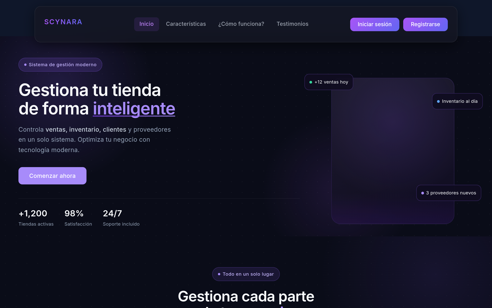 |
|  |
|  |
|  |

</details>

#### 🛠️ Stack Tecnológico
| Área | Tecnología |
|---|---|
| **Frontend** | React 19, Vite, React Router DOM, Axios |
| **Backend** | Node.js, Express 5 |
| **Base de Datos** | MySQL |
| **Autenticación** | JWT + Argon2 |
| **Validación** | Zod |
| **Despliegue** | Railway + Vercel |

#### 🔑 Credenciales
| Campo | Valor |
|---|---|
| Correo | `invitado@scynara.com` |
| Contraseña | `Invitado1234!` |

#### 🔗 Enlaces
| Recurso | Enlace |
|---|---|
| 🎨 Frontend | [scynara09-hue/Scynara-Frontend](https://github.com/scynara09-hue/Scynara-Frontend) |
| ⚙️ Backend | [scynara09-hue/Scynara-Backend](https://github.com/scynara09-hue/Scynara-Backend) |
| 🌐 Demo en Vivo | [scynara-frontend.vercel.app](https://scynara-frontend.vercel.app/) |
| 💾 Página Estática | [saulgarcia-p.github.io/localstorage_scynara](https://saulgarcia-p.github.io/localstorage_scynara/) |

---

### 🏠 Proyecto 7: La Casita — Mini Súper (Laravel)
> 🛒 Sistema académico con Laravel + MySQL + Docker, control de roles y catálogo de productos.

<details>
<summary>🖼️ Ver capturas</summary>

| |
|---|
| 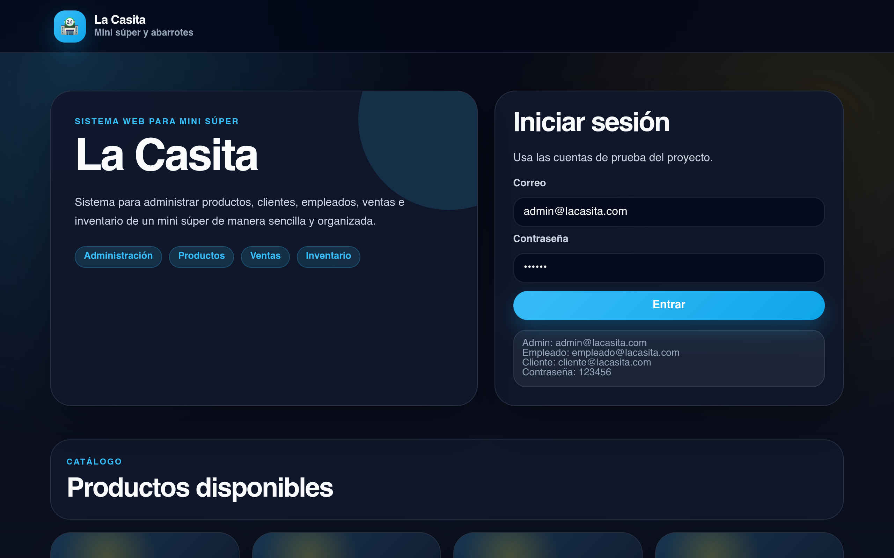 |
|  |
|  |
|  |
|  |
|  |
|  |

</details>

#### 🛠️ Stack Tecnológico
| Tecnología | Uso |
|---|---|
| Laravel + PHP | Backend MVC |
| MySQL | Base de datos relacional |
| Blade | Motor de plantillas |
| Docker + Docker Compose | Contenedores |
| Railway + GitHub Pages | Despliegue |

#### 🔑 Credenciales
| Rol | Correo | Contraseña |
|---|---|---|
| Administrador | `admin@lacasita.com` | `123456` |
| Empleado | `empleado@lacasita.com` | `123456` |
| Cliente | `cliente@lacasita.com` | `123456` |

#### 🔗 Enlaces
| Recurso | Enlace |
|---|---|
| 📦 Repositorio | [DVD-BD/LaCasita](https://github.com/DVD-BD/LaCasita) |
| 🚀 Railway | [lacasita-production-560a.up.railway.app](https://lacasita-production-560a.up.railway.app) |
| 💾 GitHub Pages | [dvd-bd.github.io/LaCasita](https://dvd-bd.github.io/LaCasita/) |

---

### 🍽️ Proyecto 8: Restaurante "Los Consentidos"
> 🌮 Sistema integral con mapa de mesas en tiempo real, códigos QR por mesa, notificaciones inteligentes y API de QR Server.

<details>
<summary>🖼️ Ver capturas de pantalla</summary>

| |
|---|
| 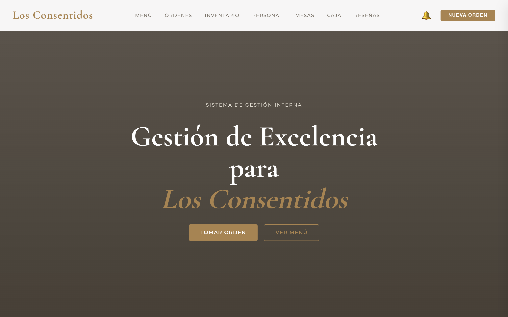 |
|  |
|  |
|  |
|  |
|  |
|  |
|  |
|  |

</details>

#### 🛠️ Stack Tecnológico
| Capa | Tecnología |
|---|---|
| **Frontend** | HTML5, CSS3, JavaScript |
| **Backend / BaaS** | Supabase (PostgreSQL) |
| **APIs Externas** | QR Server API |
| **Hosting** | GitHub Pages |

#### ✨ Funcionalidades
- 🛒 Punto de Venta con carrito interactivo
- 🍽️ Menú filtrable por categorías
- 🧺 Inventario con alertas de color (Agotado/Bajo/OK)
- 👨‍💼 Gestión de personal con turnos
- 🏷️ Mapa virtual de 10 mesas con cronómetro en tiempo real
- 💳 Caja con división de cuenta y ticket imprimible
- ⭐ Reseñas con QR único por mesa
- 🔔 Notificaciones cada 60 segundos

#### 🔗 Enlaces
| Recurso | Enlace |
|---|---|
| 📦 Código Fuente | [aeiou520814-del/abc](https://github.com/aeiou520814-del/abc) |
| 🌐 Demo en Vivo | [aeiou520814-del.github.io/abc](https://aeiou520814-del.github.io/abc/) |
| 💾 Versión Estática | [ivangutg/prueba](https://ivangutg.github.io/prueba/) |

---

### 🍽️ Proyecto 9: Sistema de Gestión de Restaurante (Equipo 21)
> 🍴 Aplicación full-stack con Vite, Vercel, Supabase y mapa interactivo del salón.

<details>
<summary>🖼️ Ver capturas</summary>

| Salón Principal | Acceso y Seguridad |
|---|---|
| 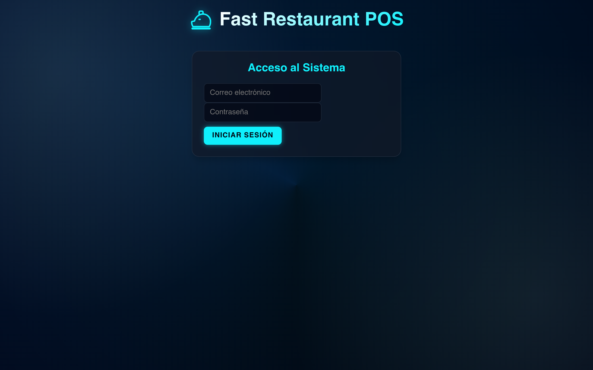 |  |
| **Menú y Órdenes** | **Almacén** |
|  |  |
| **Personal** | **Finanzas** |
|  |  |

</details>

#### 🛠️ Stack Tecnológico
| Capa | Tecnología |
|---|---|
| **Frontend** | HTML5, CSS3, JavaScript, Vite |
| **Backend** | PostgreSQL (Supabase) |
| **Hosting** | Vercel |

#### 🔑 Credenciales
| Campo | Valor |
|---|---|
| Usuario | `admin@prueba.com` |
| Contraseña | `admin` |

#### 🔗 Enlaces
| Recurso | Enlace |
|---|---|
| 📦 Código Fuente | [samLimsx/proyecto-bases](https://github.com/samLimsx/proyecto-bases.git) |
| 🚀 Demo Vercel | [proyecto-bases-snowy.vercel.app](https://proyecto-bases-snowy.vercel.app/) |
| 💾 Demo Estática | [samlimsx.github.io/proyecto-bases](https://samlimsx.github.io/proyecto-bases/) |

---

### 🐾 Proyecto 10: Patitas Sanas — Veterinaria
> 🏥 Clínica veterinaria con React + Vite, agendamiento automatizado y portal de clientes.

<details>
<summary>🖼️ Ver imágenes del proyecto</summary>

| |
|---|
|  |
|  |
|  |
|  |
|  |
|  |
|  |
|  |
|  |
|  |
|  |
|  |

</details>

#### 🛠️ Stack Tecnológico
| Capa | Tecnología |
|---|---|
| **Backend** | Node.js + Supabase (BaaS) |
| **Base de Datos** | PostgreSQL (Supabase) |
| **Frontend** | React.js + Vite, HTML, CSS, JavaScript |
| **Despliegue** | Vercel + GitHub Pages |

#### 🔑 Credenciales
| Rol | Correo | Contraseña |
|---|---|---|
| Usuario Demo | `usuariodemo@gmail.com` | `usuario1234` |
| Recepcionista | `marirep@gmail.com` | `Spam18091809.` |
| Veterinario | `veterinario@demo.com` | `vet123` |
| Admin | `admin@patitassanas.com` | `Admin1234` |

#### 🔗 Enlaces
| Recurso | Enlace |
|---|---|
| 📦 Código Fuente | [Jaely19/Patitas-Sanas](https://github.com/Jaely19/Patitas-Sanas) |
| 🌐 Demo en Vivo | [patitas-sanas.vercel.app](https://patitas-sanas.vercel.app) |

---

### 📚 Proyecto 11: Booksnexus — Red Social de Libros
> 📖 Red social para lectores con reseñas, timeline, sistema de seguidores y libros favoritos.

<details>
<summary>🖼️ Ver capturas de pantalla</summary>

| |
|---|
| 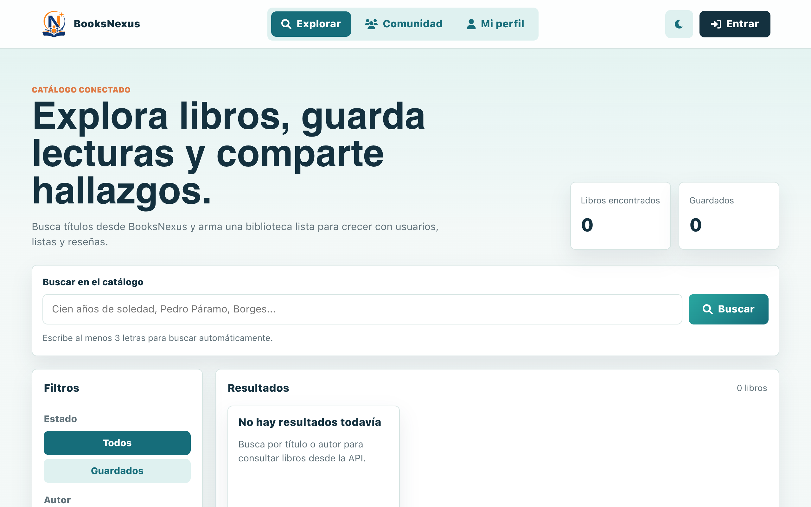 |
|  |
|  |

</details>

#### 🛠️ Stack Tecnológico
| Capa | Tecnología |
|---|---|
| **Backend** | Node.js + Express.js |
| **Base de Datos** | PostgreSQL (Supabase) |
| **Frontend** | HTML, CSS, JavaScript vanilla (Fetch API) |
| **Despliegue** | Render + GitHub Pages |

#### 🔑 Credenciales
| Campo | Valor |
|---|---|
| Acceso Admin | `CTRL + SHIFT + A` |
| Usuario | `Admin de chocolate` |
| Contraseña | `booksnexus2026` |

#### 🔗 Enlaces
| Recurso | Enlace |
|---|---|
| ⚙️ Backend | [Diegocstln/booksnexus-back](https://github.com/Diegocstln/booksnexus-back) |
| 🎨 Frontend | [Diegocstln/mi-proyecto-bd](https://github.com/Diegocstln/mi-proyecto-bd) |
| 🌐 Demo en Vivo | [diegocstln.github.io/mi-proyecto-bd](https://diegocstln.github.io/mi-proyecto-bd/) |
| 💾 Versión Estática | [?mode=local](https://diegocstln.github.io/mi-proyecto-bd/?mode=local) |
| 🔌 API Render | [booksnexus-back.onrender.com](https://booksnexus-back.onrender.com) |

---

### ☕ Proyecto 12: DestinyCafe — Cafetería Artesanal
> ☕ Gestión integral de cafetería en CDMX con control de insumos, proveedores y reportes semanales.

<details>
<summary>🖼️ Ver imágenes del proyecto</summary>

| |
|---|
| 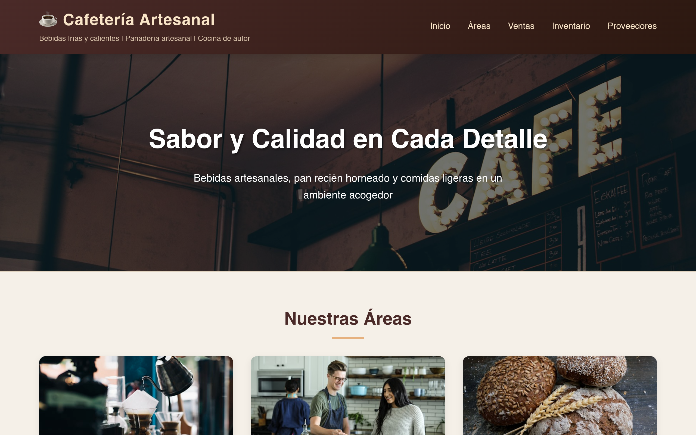 |
|  |
|  |
|  |

</details>

#### 🛠️ Stack Tecnológico
| Capa | Tecnología |
|---|---|
| **Frontend** | HTML5, CSS3, JavaScript |
| **Base de Datos** | PostgreSQL (Supabase) |
| **Despliegue** | GitHub Pages + Supabase Cloud |

#### ✨ Funcionalidades
- 📦 Control de inventario con alertas de reabastecimiento (3-4 días)
- 🏪 Catálogo de proveedores (Central de Abastos, Costco, Sam's)
- 💰 Gestión de ventas con reportes semanales
- 📅 Control de fechas de vencimiento

#### 👥 Equipo
- Alarcón Herrera Julio Alexis
- Cedillo Baeza Martha Clara
- Santos Martínez Perla

#### 🔗 Enlaces
| Recurso | Enlace |
|---|---|
| 📦 Código Fuente | [PerlaSantos/DestinyCafe](https://github.com/PerlaSantos/DestinyCafe.git) |
| 🌐 Demo en Vivo | [perlasantos.github.io/DestinyCafe](https://perlasantos.github.io/DestinyCafe/) |

---

### 💳 Proyecto 13: Payapp+ — Servicios Financieros
> 💰 Gestor financiero con autenticación segura, transacciones entre usuarios y administración de perfiles.

<details>
<summary>🖼️ Ver capturas</summary>

| |
|---|
|  |
|  |
| 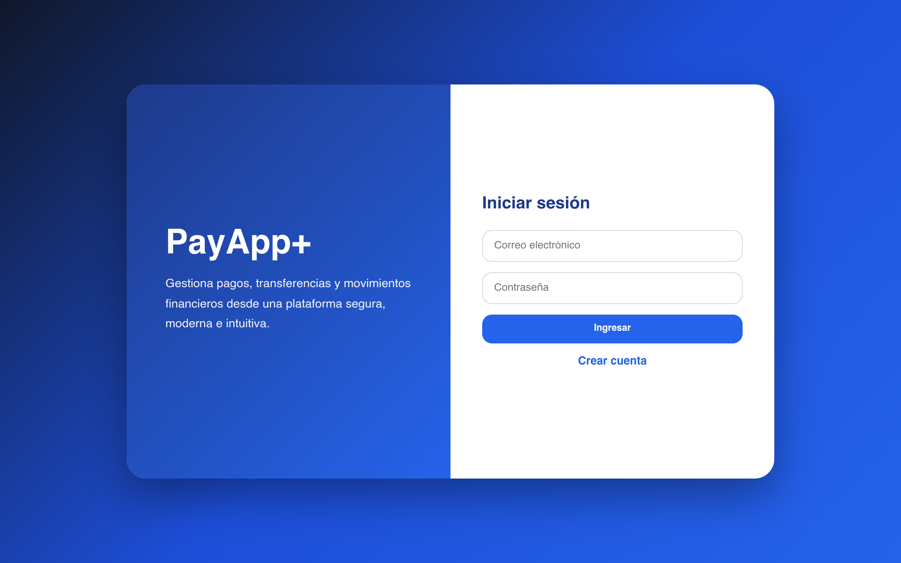 |

</details>

#### 🛠️ Stack Tecnológico
| Capa | Tecnología |
|---|---|
| **Backend** | Node.js + Express.js |
| **Base de Datos** | PostgreSQL |
| **Frontend** | HTML, CSS, JavaScript, Bootstrap |

#### 👥 Equipo
- Acosta Davila Omar Esau
- Bernal Cruz Hector Daniel
- Campos Blancas Vanessa

#### 🔗 Enlaces
| Recurso | Enlace |
|---|---|
| 📦 Código Fuente | [iiTzDaany/PayApp](https://github.com/iiTzDaany/PayApp/tree/main) |
| 🌐 Demo en Vivo | [iitzdaany.github.io/PayApp](https://iitzdaany.github.io/PayApp/) |

---

### 💈 Proyecto 14: Barber Cerdas — Academia The Hipster
> 💈 Sistema de reservas con Supabase Realtime, RLS, Vercel Functions y confirmación por email.

<details>
<summary>🖼️ Ver capturas de pantalla</summary>

| |
|---|
|  |
|  |
|  |
|  |
|  |
|  |

</details>

#### 🛠️ Stack Tecnológico
| Capa | Tecnología |
|---|---|
| **Frontend** | HTML5, CSS3, JavaScript Vanilla |
| **Backend / BD** | Supabase (PostgreSQL + Auth + REST) |
| **Realtime** | Supabase Realtime (WebSocket + polling fallback) |
| **Serverless** | Vercel Functions (Node.js) + Resend |
| **Seguridad** | Row Level Security (RLS) |

#### ✨ Funcionalidades
- 📅 Reserva en línea (sucursal → servicios → barbero → horario)
- ✉️ Confirmación por email con token de un solo uso (10 min)
- 🚦 Dashboard con semáforo de barberos en tiempo real
- 🚶 Registro de walk-ins desde kiosko
- 📞 Gestión de reservas telefónicas
- 🆔 Identidad portable (historial conservado)
- 🛡️ Anti-spam: 1 reserva telefónica/día/sucursal

#### 🔗 Enlaces
| Recurso | Enlace |
|---|---|
| 📦 Código Fuente | [StrlgE26/Barberia](https://github.com/StrlgE26/Barberia) |
| 🌐 Demo en Vivo | [koddesolutions.com](https://www.koddesolutions.com/) |

---

### 💃 Proyecto 15: Compañía de Danza — Grupo Jaltepec
> 💃 Administración de integrantes, bailes, presentaciones y cuadro con Supabase RPC.

<details>
<summary>🟩 Ver capturas de pantalla</summary>

| |
|---|
| 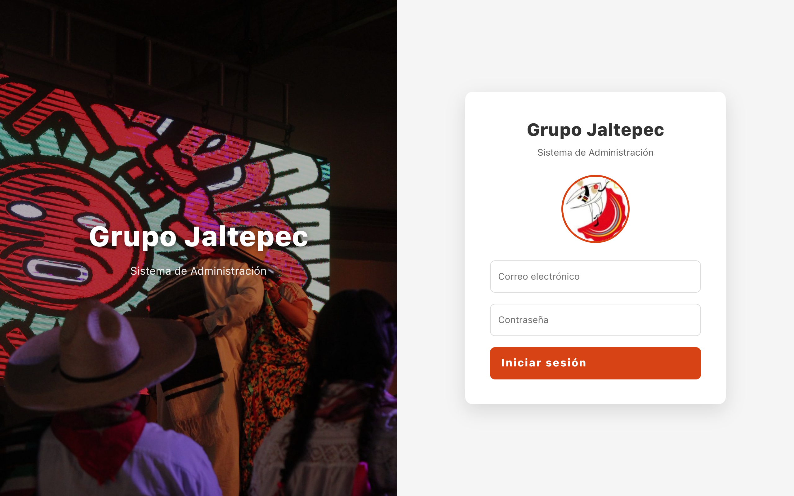 |
|  |
|  |
|  |
|  |
|  |
|  |
|  |
|  |
|  |
|  |
|  |
|  |
|  |
|  |
|  |
|  |
|  |
|  |

</details>

#### 🛠️ Stack Tecnológico
| Capa | Tecnología |
|---|---|
| **Frontend** | HTML, CSS, JavaScript vanilla |
| **Base de Datos** | PostgreSQL |
| **Backend** | Supabase (RPC `exec_sql`) |
| **Despliegue** | Vercel |

#### 🔑 Credenciales
| Campo | Valor |
|---|---|
| Usuario | `ana.ramirez@compania.pe` |
| Contraseña | `Password123!` |

#### 🔗 Enlaces
| Recurso | Enlace |
|---|---|
| 📦 Código Fuente | [avril1699/Grupo-Jaltepec-BD](https://github.com/avril1699/Grupo-Jaltepec-BD/tree/main) |
| 🚀 Demo Vercel | [grupo-jaltepec-bd.vercel.app](https://grupo-jaltepec-bd.vercel.app/) |
| 💾 Página Estática | [paginaestaticagj.vercel.app](https://paginaestaticagj.vercel.app/) |

---

### 🚗 Proyecto 16: Refaccionaria Leo
> 🚗 E-commerce de refacciones con PHP + PDO + PostgreSQL y tunneling con Ngrok.

<details>
<summary>🖼️ Ver capturas de pantalla</summary>

| |
|---|
|  |
|  |
|  |
| 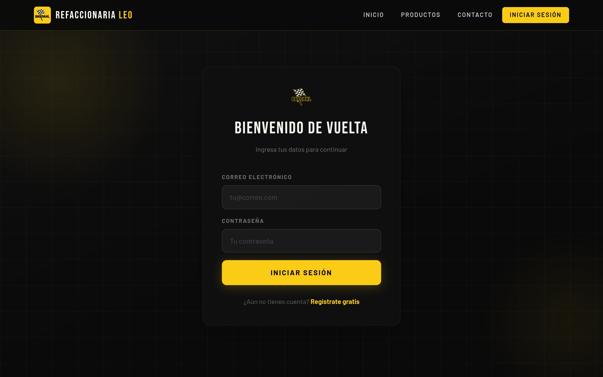 |

</details>

#### 🛠️ Stack Tecnológico
| Capa | Tecnología |
|---|---|
| **Frontend** | HTML5, Tailwind CSS, JavaScript |
| **Backend** | PHP (PDO) |
| **Base de Datos** | PostgreSQL |
| **Infraestructura** | XAMPP, Ngrok, GitHub Pages |

#### 👥 Equipo
- Martinez Marin Nahum
- Miranda Arredondo Miguel Angel

#### 🔑 Credenciales
| Página | Usuario | Contraseña |
|---|---|---|
| Principal | `tester1@test.com` | `tester1234` |
| Estática (Tester) | `tester@refaccionarialeo.com` | `tester123` |
| Estática (Cliente) | `cliente@correo.com` | `cliente123` |

#### 🔗 Enlaces
| Recurso | Enlace |
|---|---|
| 📦 Código Fuente | [Nahum1802/Refaccionaria-Leo](https://github.com/Nahum1802/Refaccionaria-Leo) |
| 🌐 Demo en Vivo | [nahum1802.github.io/Refaccionaria-Leo](https://nahum1802.github.io/Refaccionaria-Leo/) |
| 💾 Versión Estática | [miraanda21.github.io/Refaccionaria-Leo-Static](https://miraanda21.github.io/Refaccionaria-Leo-Static/) |

---

### 📦 Proyecto 17: Distribuidora de Abarrotes Kafra
> 📦 Dashboard de gestión de inventario, ventas y distribución con Node.js + PostgreSQL.

<details>
<summary>🖼️ Ver capturas de pantalla</summary>

| |
|---|
|  |
|  |
| 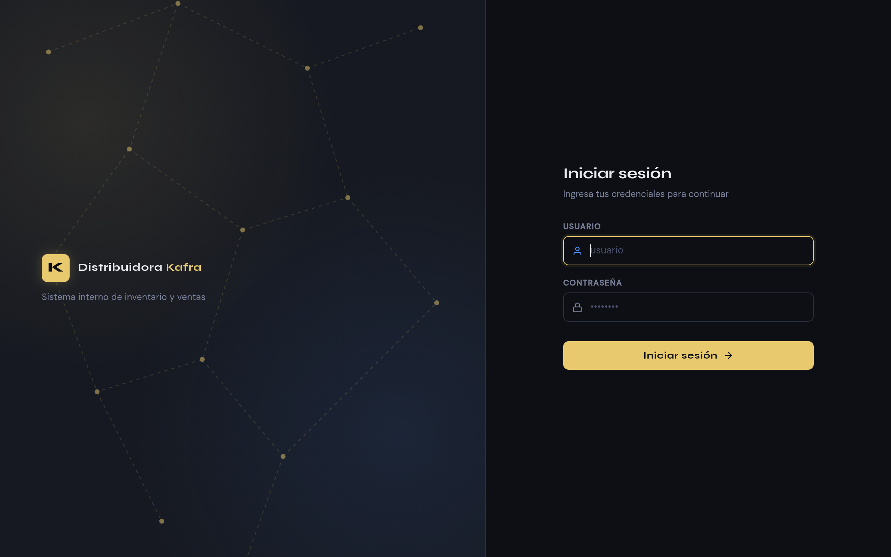 |

</details>

#### 🛠️ Stack Tecnológico
| Capa | Tecnología |
|---|---|
| **Backend** | Node.js + Express |
| **Base de Datos** | PostgreSQL |
| **Frontend** | HTML, CSS, JavaScript |
| **Hosting** | GitHub Pages + Render |

#### 🔑 Credenciales
| Página | Usuario | Contraseña |
|---|---|---|
| Estática | `admin` | `123` |
| Consulta | `consulta` | `rdBg2yGGGR` |

#### 🔗 Enlaces
| Recurso | Enlace |
|---|---|
| 📦 Código Fuente | [DerekArenas/kafra-dashboard](https://github.com/DerekArenas/kafra-dashboard) |
| 🌐 Demo en Vivo | [derekarenas.github.io/kafra-dashboard](https://derekarenas.github.io/kafra-dashboard/) |
| 💾 Página Estática | [sodaplanta.github.io/sitio-practica](https://sodaplanta.github.io/sitio-practica/) |

---

### 🐾 Proyecto 18: Huellitas — Fundación de Animales
> 🐾 Plataforma web para refugio con sistema de donaciones y adopciones.

<details>
<summary>🖼️ Ver capturas de pantalla</summary>

| |
|---|
|  |
| 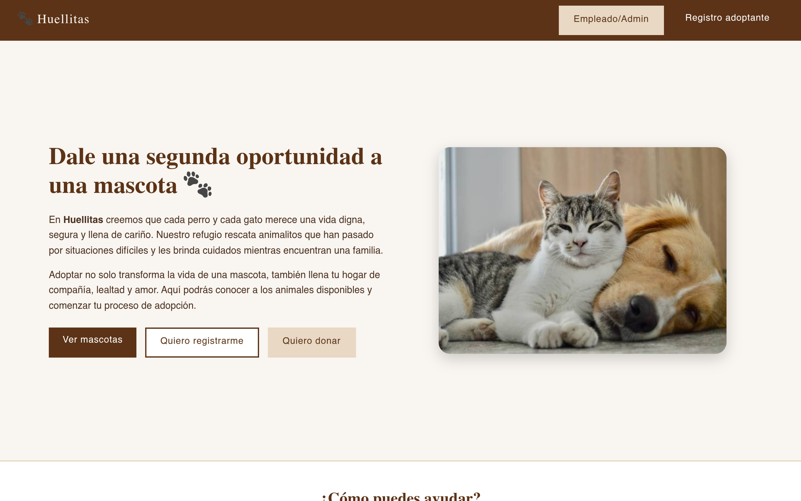 |
|  |
|  |
|  |
|  |

</details>

#### 🛠️ Stack Tecnológico
| Tecnología | Uso |
|---|---|
| JavaScript | Frontend |
| PostgreSQL | Base de datos |
| CSS | Estilos |
| GitHub | Hosting |

#### 🔑 Credenciales
| Página | Usuario | Contraseña |
|---|---|---|
| Principal (Admin) | `EMP-0003` | `12345` |
| Estática (Admin) | `EMP-0042` | `1234` |
| Estática (Admin alterno) | `EMP-0001` | `admin123` |
| Estática (Empleado) | `EMP-0002` | `empleado123` |

#### 🔗 Enlaces
| Recurso | Enlace |
|---|---|
| 📦 Código Fuente | [sofi-14/gitfin](https://github.com/sofi-14/gitfin) |
| 🌐 Demo en Vivo | [sofi-14.github.io/gitfin](https://sofi-14.github.io/gitfin/) |
| 💾 Versión Estática | [dianalizzt.github.io/huellitas-estatico](https://dianalizzt.github.io/huellitas-estatico/) |

---

### 🐾 Proyecto 19: Patitas Felices — Refugio de Animales
> 🐾 Plataforma con sistema de adopción, historial médico y panel de estadísticas en tiempo real.

<details>
<summary>🖼️ Ver capturas de pantalla</summary>

| |
|---|
|  |
|  |
| 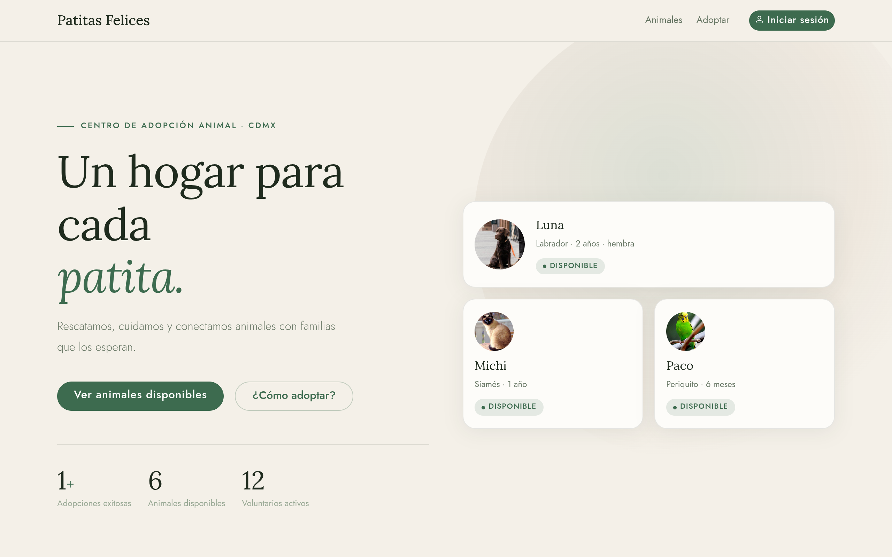 |
|  |

</details>

#### 🛠️ Stack Tecnológico
| Capa | Tecnología |
|---|---|
| **Backend** | Node.js + Express.js |
| **Base de Datos** | PostgreSQL (Supabase) |
| **Frontend** | HTML, CSS (Bootstrap 5), JavaScript |
| **Despliegue** | Render + GitHub Pages |

#### ✨ Funcionalidades
- 👥 Roles: admin, veterinario, voluntario
- 🐕 Catálogo con filtros por especie y estado
- 📝 Sistema de solicitudes de adopción
- 🏥 Historial médico por animal
- 📊 Panel de estadísticas en tiempo real
- 📸 Subida de fotos en Base64

#### 🔑 Credenciales
| Campo | Valor |
|---|---|
| Usuario | `MON-001` |
| Contraseña | `123456` |

#### 🔗 Enlaces
| Recurso | Enlace |
|---|---|
| 📦 Código Fuente | [JOKERKORIO/patitas-api](https://github.com/JOKERKORIO/patitas-api) |
| 🚀 API Railway | [patitas-backend-production.up.railway.app](https://patitas-backend-production.up.railway.app/) |
| 🌐 Web GitHub Pages | [jokerkorio.github.io/patitas-api](https://jokerkorio.github.io/patitas-api/#) |

---

### 🥩 Proyecto 20: Carnicería Camacho
> 🥩 Gestión integral de carnicería con Supabase, RLS y cálculo automático de impuestos.

<details>
<summary>🖼️ Ver capturas</summary>

| |
|---|
|  |
|  |
| 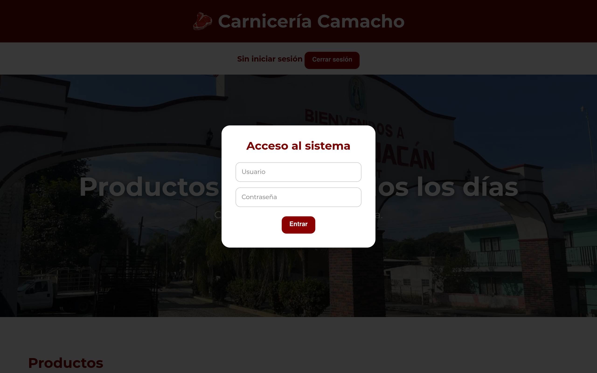 |

</details>

#### 🛠️ Stack Tecnológico
| Capa | Tecnología |
|---|---|
| **Base de Datos** | PostgreSQL (Supabase) |
| **Frontend** | HTML, CSS, JavaScript Vanilla |
| **Backend** | Supabase API REST + funciones SQL |
| **Seguridad** | Row Level Security (RLS) + Policies |
| **Despliegue** | GitHub Pages |

#### ✨ Funcionalidades
- 📦 CRUD de productos, clientes, proveedores y ventas
- 💰 Cálculo automático de impuesto (10%) y totales
- 👥 Roles: Administrador y Profesor (solo lectura)
- 🔐 `anon public key` de Supabase

#### 🔑 Credenciales
| Campo | Valor |
|---|---|
| Usuario | `profesor` |
| Contraseña | `chocolate` |

#### 🔗 Enlaces
| Recurso | Enlace |
|---|---|
| 📦 Código Fuente | [ivanrvillegas10-dev/carniceria](https://github.com/ivanrvillegas10-dev/carniceria) |
| 🌐 Demo en Vivo | [ivanrvillegas10-dev.github.io/carniceria](https://ivanrvillegas10-dev.github.io/carniceria/) |

---

### 📖 Proyecto 21: BiblioTech — Biblioteca ESCOM
> 📖 Biblioteca universitaria con Open Library API, i18n (ES/EN/FR) y modo claro/oscuro.

<details>
<summary>🖼️ Ver capturas de pantalla</summary>

| Pantalla de Inicio | Inicio de Sesión |
|---|---|
|  |
| **Registro** | **Sección** |
| 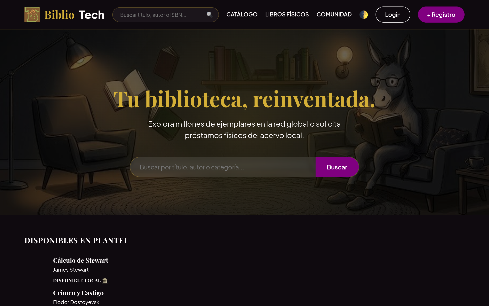 |  |

</details>

#### 🛠️ Stack Tecnológico
| Capa | Tecnología |
|---|---|
| **Backend / BD** | PostgreSQL (Supabase) + Supabase Auth |
| **API Externa** | Open Library API REST |
| **Frontend** | HTML5, CSS3 (Flexbox/Grid), JavaScript vanilla |
| **Despliegue** | GitHub Pages |

#### ✨ Funcionalidades
- 🔍 Búsqueda global y local en tiempo real
- 📅 Préstamos con cálculo automático (7 días)
- 📄 Paginación dinámica sin recargar
- 🎨 Modo Claro / Modo Oscuro
- 🌐 i18n: Español, Inglés, Francés

#### 🔗 Enlaces
| Recurso | Enlace |
|---|---|
| 📦 Código Fuente | [xsuik33/xsuik33.github.io](https://github.com/xsuik33/xsuik33.github.io) |
| 🌐 Demo en Vivo | [xsuik33.github.io](https://xsuik33.github.io) |

---

### 🏥 Proyecto 22: Sistema de Agendado de Citas Médicas
> 🏥 Hospital con gestión de citas, recetas médicas y roles por especialidad.

<details>
<summary>🖼️ Ver capturas</summary>

| |
|---|
|  |
|  |
| 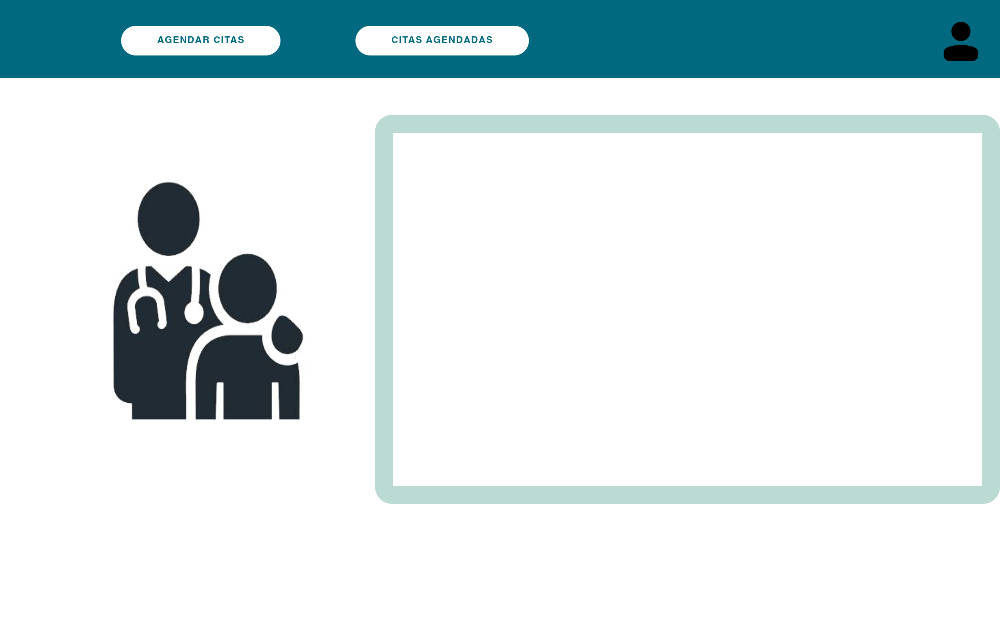 |

</details>

#### 🛠️ Stack Tecnológico
| Capa | Tecnología |
|---|---|
| **Backend** | Java, Apache Netbeans |
| **Base de Datos** | PostgreSQL |
| **Frontend** | HTML, CSS (Bootstrap 5), JavaScript |
| **Despliegue** | Save in cloud |

#### 👥 Equipo
- Flores Vargas Augusto Hazel
- Hernandez Zuñiga Andrea Veronica
- Linares Medina Fernando Agustin
- Angeles Salinas Daniel Alejandro

#### 🔑 Credenciales
| Página | Usuario | Contraseña |
|---|---|---|
| Estática (Admin) | `admin@medico.com` | `Amdhn123` |
| Estática (Médico) | `daniel@medico.com` | `Daniel123` |

#### 🔗 Enlaces
| Recurso | Enlace |
|---|---|
| 📦 Código Fuente | [AugustoHFV/SistemaMedicoHOST](https://github.com/AugustoHFV/SistemaMedicoHOST) |
| 🌐 Demo en Vivo | [sistemamedico-1gmy.onrender.com](https://sistemamedico-1gmy.onrender.com) |
| 💾 Página Estática | [warinsanomachine.github.io/sistema-medico-estatico](https://warinsanomachine.github.io/sistema-medico-estatico/) |

---

### 📊 Proyecto 23: Data Warehouse CDMX — Agua y Clima
> 📊 Análisis de correlación entre consumo de agua y clima en CDMX (2019) con Docker + ETL.

#### 🛠️ Stack Tecnológico
| Tecnología | Uso |
|---|---|
| Docker + Docker Compose | Contenedores |
| PostgreSQL 16 | Base de datos |
| SQL | Consultas |
| CSV | Datos |
| Modelo Estrella | Diseño DW |
| ETL | Extracción y transformación |
| Open-Meteo, SACMEX | APIs de datos |

#### ✨ Funcionalidades
- 🔄 Carga automática de SQL al iniciar contenedor
- 📊 Tablas de staging, dimensiones y hechos
- 🌡️ Integración bimestral de agua + clima diario
- 📈 Consultas analíticas (consumo, temperatura, lluvia)

> ⚠️ **Nota:** Este proyecto no tiene demo web. Se ejecuta localmente con Docker.

#### 🔗 Enlaces
| Recurso | Enlace |
|---|---|
| 📦 Proyecto Original | [omarpulidom/data_warehouse_cdmx](https://github.com/omarpulidom/data_warehouse_cdmx) |
| 🍴 Fork | [2gmyq2crw8-spec/Proyecto-9-Data-Warehouse-67](https://github.com/2gmyq2crw8-spec/Proyecto-9-Data-Warehouse-67.git) |

---

### 📝 Proyecto 24: PAPIROSSO — Papelería
> 📝 Automatización de cobros, registro de mercancía y pedidos en línea.

<details>
<summary>🖼️ Ver capturas de pantalla</summary>

| |
|---|
| 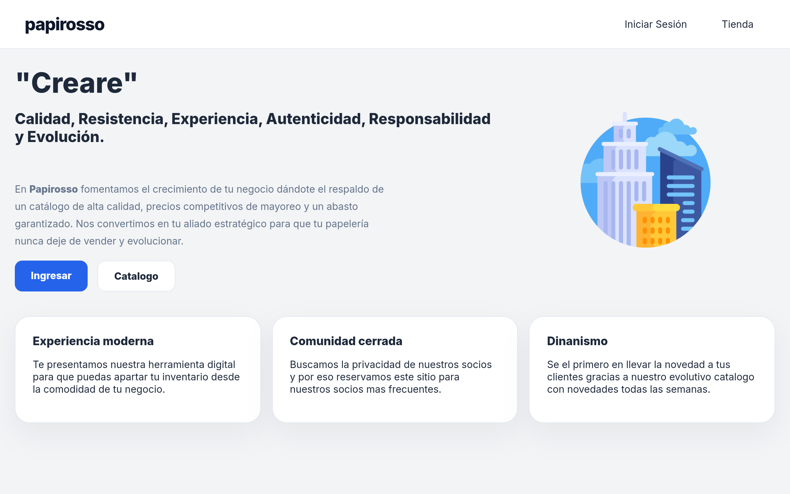 |
|  |
|  |
|  |

</details>

#### 👥 Integrantes
- Rodríguez Martínez José
- Rosales Juarez Alexis

#### 🔑 Credenciales
| Rol | Usuario | Contraseña |
|---|---|---|
| Trabajador | `CHOC000101HDFRRR00` | `chocolate123` |
| Cliente | `CHOC000101HDFRRR99` | `chocolate123` |

#### 🔗 Enlaces
| Recurso | Enlace |
|---|---|
| 📦 GitHub | [jorvsk2007/jorvsk2007.github.io](https://github.com/jorvsk2007/jorvsk2007.github.io.git) |
| 🌐 Landing Page | [jorvsk2007.github.io/Papirosso](https://jorvsk2007.github.io/Papirosso/) |
| 💾 Versión Estática | [thoyx.github.io/PapirossoOffline](https://thoyx.github.io/PapirossoOffline/) |

---

### 🥩 Proyecto 25: Carnicería la Ideal
> 🥩 Control de recepción de productos con evaluación sensorial, temperatura y panel admin.

<details>
<summary>🖼️ Ver capturas</summary>

| |
|---|
|  |
|  |
|  |
| 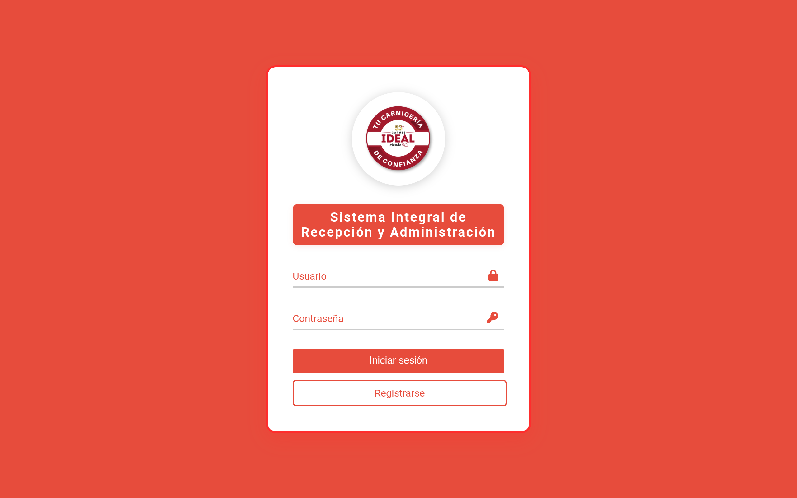 |

</details>

#### 🛠️ Stack Tecnológico
| Capa | Tecnología |
|---|---|
| **Frontend** | HTML5, CSS3, JavaScript |
| **Backend** | PHP 8 |
| **Base de Datos** | MySQL (InfinityFree) |
| **SGBD** | phpMyAdmin |
| **Hosting** | InfinityFree |

#### ✨ Funcionalidades
- 🔐 Autenticación con `password_hash()` (bcrypt)
- 🛡️ Prepared Statements (anti SQL Injection)
- 👥 Roles: `admin` y `operativo`
- 📊 Panel admin con estadísticas en tiempo real
- 📤 Exportación a CSV
- 🌡️ Control de temperatura con slider
- 👃 Evaluación sensorial (olor, color, textura)

#### 👥 Equipo
- Alejandro Aguilera Ceballos
- José Ángel Malvaez Flores
- Gomez Belmont Wendy Nathaly

#### 🔑 Credenciales
| Usuario | Contraseña | Rol |
|---|---|---|
| `2` | `Aguilucho5000$` | Administrador |
| `1` | `Aguilucho5000$` | Operativo |

#### 🔗 Enlaces
| Recurso | Enlace |
|---|---|
| 🌐 Sistema en Línea | [carnicerialaidealescom1.page.gd](https://carnicerialaidealescom1.page.gd/CARNES/Login.html) |
| 📦 Código Fuente | [aleaguiballos-cell/ProyectoBD2](https://github.com/aleaguiballos-cell/ProyectoBD2) |

---

### 🔧 Proyecto 26: Ferretería TICO — Inventario
> 🔧 Sistema de inventario con Supabase REST API, alertas de stock bajo y modo demo.

<details>
<summary>🖼️ Ver capturas</summary>

| |
|---|
| 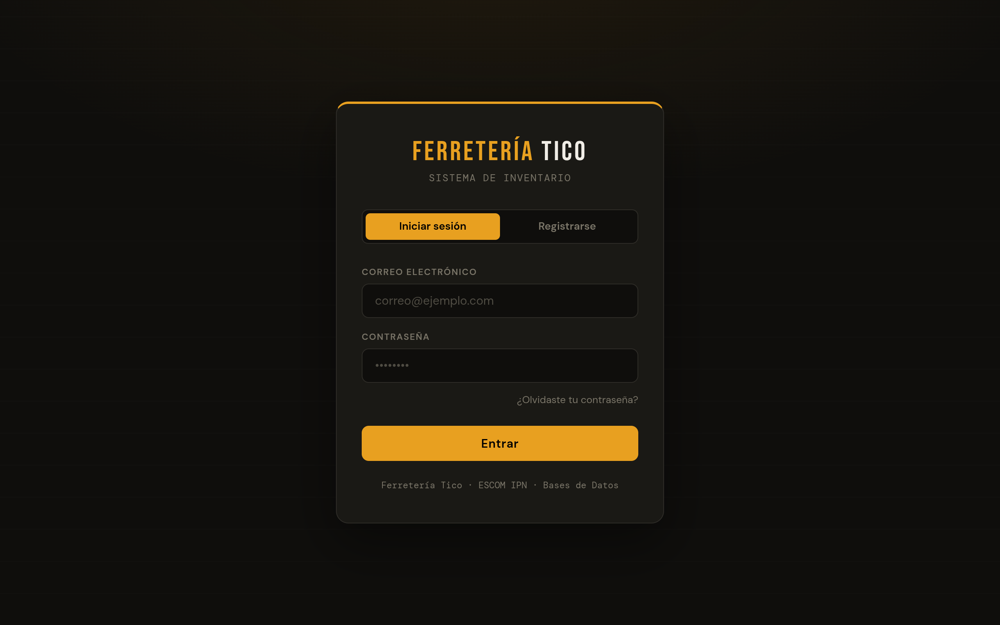 |
|  |
|  |
|  |

</details>

#### 🛠️ Stack Tecnológico
| Capa | Tecnología |
|---|---|
| **Frontend** | HTML5, CSS3, JavaScript ES6+ |
| **Base de Datos** | PostgreSQL (Supabase) |
| **API** | Supabase REST API |
| **Hosting** | GitHub Pages |

#### 👥 Integrantes
- Navarrete Hernández Laura Itzel
- Patiño Nicasio Diego

#### 🔑 Credenciales
| Campo | Valor |
|---|---|
| Usuario | `ferreteriatico@gmail.com` |
| Contraseña | `ferreteriatico` |

#### 🔗 Enlaces
| Recurso | Enlace |
|---|---|
| 🌐 GitHub Pages | [itzelnavarrete.github.io/ferreteria-TICO](https://itzelnavarrete.github.io/ferreteria-TICO/index.html) |
| 📦 Repositorio | [itzelnavarrete/ferreteria-TICO](https://github.com/itzelnavarrete/ferreteria-TICO) |

---

## 📌 Instrucciones de Entrega

Cada estudiante debe integrar su proyecto a este repositorio mediante un **Pull Request (PR)** desde su fork.

### Pasos rápidos

```bash
# 1. Fork del repositorio a tu cuenta de GitHub

# 2. Clonar tu fork
git clone https://github.com/<tu-usuario>/DB-Coursework-2026-2.git
cd DB-Coursework-2026-2

# 3. Modificar el README.md con tu proyecto

# 4. Commit y push
git add <tu-usuario>
git commit -m "Add project for <tu-usuario>"
git push origin main

# 5. Abrir Pull Request hacia gabrielhuav/DB-Coursework-2026-2 (base: main)

